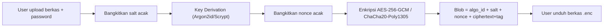
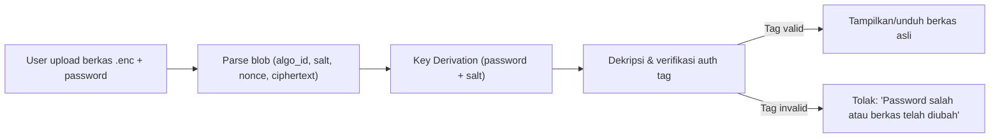
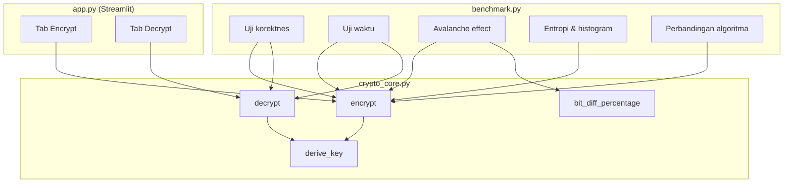

# Rancangan Sistem — NACRYP (Brankas File Pribadi Terenkripsi)

## Alur Proses Enkripsi

## Alur Proses Dekripsi

## Arsitektur Aplikasi

## Rancangan Antarmuka (ringkas)

- **Tab Encrypt**: file uploader, input password, pilihan algoritma
  (radio button AES-256-GCM / ChaCha20-Poly1305), tombol "Enkripsi",
  tombol download hasil.
- **Tab Decrypt**: file uploader (.enc), input password, tombol
  "Dekripsi", pesan sukses/gagal yang jelas, tombol download hasil
  bila sukses.

## Format Blob Terenkripsi

| Bagian | Ukuran | Keterangan |
|---|---|---|
| algo_id | 1 byte | 0x01 = AES-256-GCM, 0x02 = ChaCha20-Poly1305 |
| salt | 16 byte | acak per enkripsi, untuk key derivation |
| nonce | 12 byte | acak per enkripsi |
| ciphertext + tag | variabel | hasil enkripsi, tag menyatu (AEAD) |
